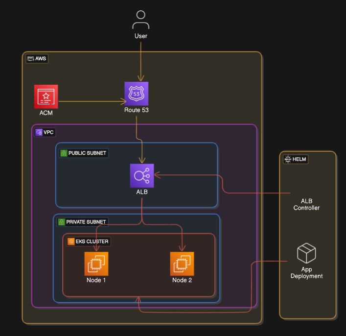

# 🏗️ Terraform-Based EKS Cluster & VPC Deployment  

## 🏛️ Architecture  

### **Project Architecture**  
This project provisions an **EKS cluster** and **VPC** using **Terraform**. It also integrates the **AWS Load Balancer Controller** to expose applications publicly via an **Application Load Balancer (ALB)**. The application deployment is also managed within the Terraform setup.  

---

## 🚀 Features  

- ✅ Automated **Infrastructure as Code (IaC)** deployment using Terraform  
- ✅ Custom **VPC** with public and private subnets  
- ✅ **AWS Load Balancer Controller** for ALB provisioning  
- ✅ **Application Deployment** managed within Terraform  
- ✅ **Scalable & Secure** Kubernetes architecture  

---

## 🛠️ Prerequisites  

Ensure the following tools are installed before proceeding:  

- [AWS CLI](https://docs.aws.amazon.com/cli/latest/userguide/install-cliv2.html)  
- [Terraform](https://developer.hashicorp.com/terraform/tutorials/aws-get-started/install-cli)  
- [kubectl](https://kubernetes.io/docs/tasks/tools/install-kubectl/)  

---

## 📌 Steps to Deploy  

### 1️⃣ Clone the Repository  

```bash
git clone https://github.com/AbdullahTarar/EKS-Cluster-IAC.git
cd EKS-Cluster-IAC
```
### 2️⃣ Configure AWS CLI

```bash
aws configure
```
### 3️⃣ Deploy Infrastructure

```bash
terraform init
terraform plan -out=tfplan
terraform apply tfplan
```
This will provision:

- A VPC with public & private subnets

- An EKS cluster

- Required IAM roles & policies

- Security groups & networking configurations

- AWS Load Balancer Controller

- Application Deployment

### 4️⃣ Retrieve ALB URL & Access the Application

```bash
kubectl get ingress -A
```
Copy the ALB DNS name and access the application in your browser.

## 📊 Monitoring

```bash
kubectl get pods
kubectl get services
kubectl logs -f <pod-name>
```
## 👥 Contributors

*   Abdullah Tarar
    

License
-------

This project is licensed under the MIT License.
Let me know if you’d like to simplify this further!
